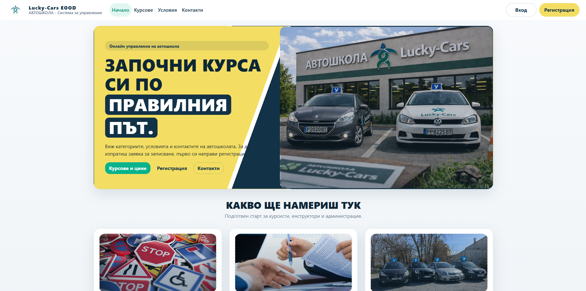
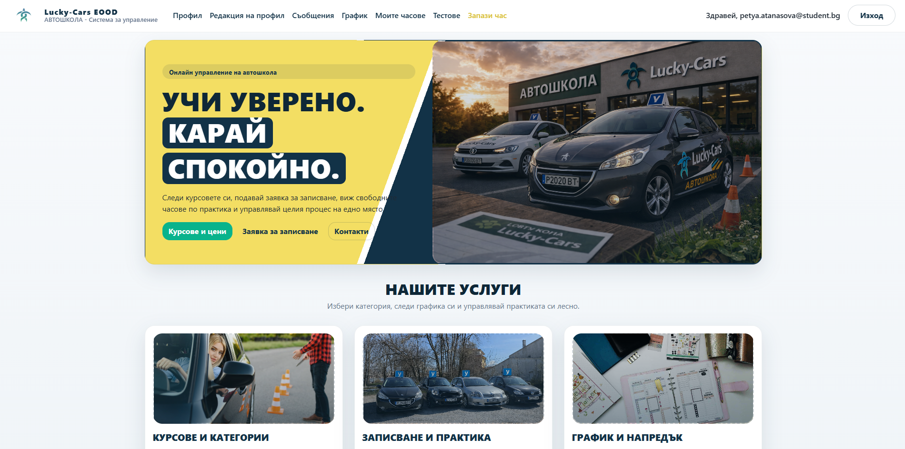
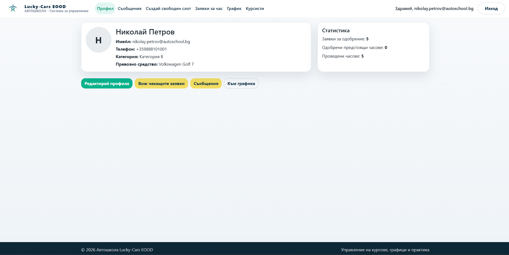
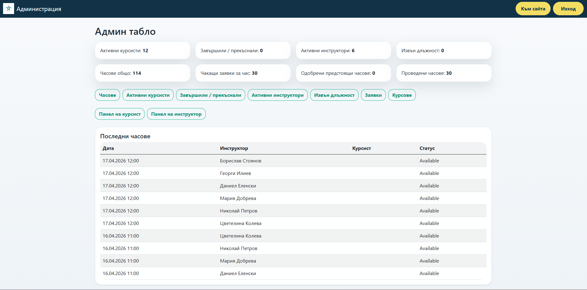
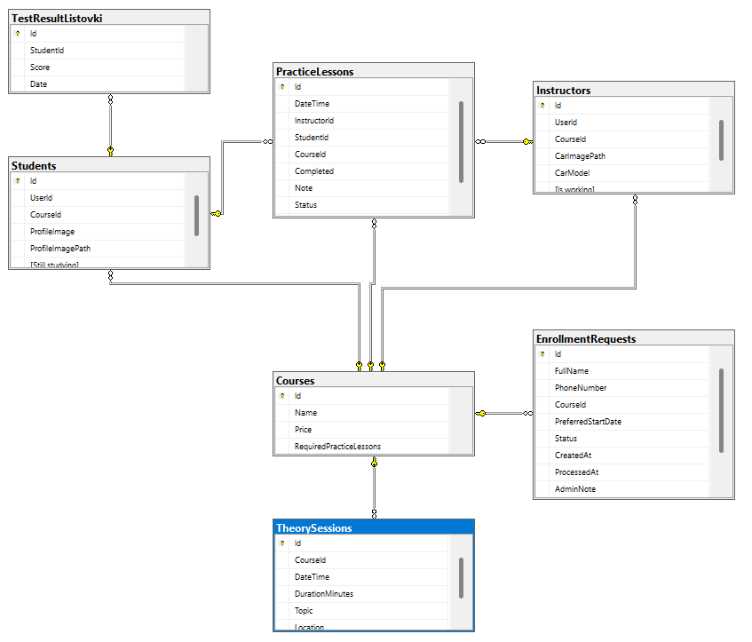

# 02-design-and-architecture

## 1\. Тип на приложението

Проектът представлява **уеб базирана система за управление на автошкола**.  
Приложението се използва през браузър и има различни изгледи и функционалности според ролята на потребителя – **гост, курсист, инструктор и администратор**.

Основната цел на системата е да улесни:

* записването на нови курсисти;
* управлението на профили;
* организирането на практически часове;
* комуникацията между курсист, инструктор и администратор;
* проследяването на статуса на обучението.

## 2\. Структура на проекта

Проектът е организиран като ASP.NET Core MVC приложение. Основните части са разделени по папки според тяхната роля в приложението.

### Основни папки:

* **Controllers** – съдържа контролерите за основната логика на страниците;
* **Models** – съдържа моделите и ентититата за базата данни;
* **Views** – съдържа изгледите (страниците), които се визуализират към потребителя;
* **ViewModels** – съдържа помощни модели за подаване на данни към изгледите;
* **Services** – съдържа бизнес логиката;
* **Data** – съдържа контекста на базата данни, seed логиката и миграциите;
* **Areas/Admin** – съдържа отделна административна част на системата;
* **wwwroot** – съдържа статични ресурси като CSS, JavaScript, изображения и качени снимки.

## 3\. Основни модули / слоеве

Проектът може да бъде разгледан на няколко основни слоя:

### 3.1. Presentation Layer

Това е слоят за визуализация:

* Razor Views;
* Layout файлове;
* partial views;
* форми за вход, регистрация, профили, графици и панели.

### 3.2. Controllers Layer

Контролерите приемат заявки от потребителя, извикват нужната логика и връщат изглед или резултат.
Примери:

* HomeController
* StudentController
* InstructorController
* RequestsController
* StudentPanelController
* InstructorPanelController
* DashboardController

### 3.3. Business Logic Layer

Тук се намира логиката на приложението, реализирана основно чрез service класове.
Примери:

* StudentService
* InstructorService
* FileStorageService

### 3.4. Data Layer

Този слой работи с базата данни:

* ApplicationDbContext
* Entity Framework Core модели
* seed файлове за начални данни
* миграции

## 4\. Основни класове / обекти / ентитита

Основните обекти в системата са:

### ApplicationUser:

Разширение на стандартния Identity потребител.  
Съдържа данни за:

* имейл;
* парола;
* име;
* фамилия;
* телефон;
* профилна снимка.

### Student:

Представя курсист в системата.  
Основни полета:

* Id
* UserId
* CourseId
* StillStudying

### Instructor:

Представя инструктор в системата.  
Основни полета:

* Id
* UserId
* CourseId
* CarModel
* CarImagePath
* IsWorking

### Course:

Представя категория/курс в автошколата.  
Основни полета:

* Id
* Name
* Description
* Price

### EnrollmentRequest:

Заявка за записване на нов потребител.  
Основни полета:

* Id
* FirstName
* LastName
* Email
* PhoneNumber
* CourseId
* PreferredStartDate
* Status
* AdminNote
* CreatedStudentUserId

### PracticeLesson:

Практически час между курсист и инструктор.  
Основни полета:

* Id
* StudentId
* InstructorId
* CourseId
* DateTime
* DurationMinutes
* Status
* Completed
* Note

### UserMessage:

Използва се за съобщения/известия в системата.  
Примерни случаи:

* бележка от администратора;
* уведомление за одобрен/отказан час;
* уведомление при пренасрочване или отмяна.

### TestResultListovki:

Използва се за резултати от тестове / листовки.

## 5\. Таблици и връзки (има база данни)

Проектът използва релационна база данни чрез Entity Framework Core.

### Основни таблици:

* AspNetUsers
* AspNetRoles
* AspNetUserRoles
* Students
* Instructors
* Courses
* EnrollmentRequests
* PracticeLessons
* UserMessages
* TestResultListovki

### Основни връзки:

* Един ApplicationUser може да бъде свързан с **един Student** или **един Instructor**;
* Един Course може да има **много Students**;
* Един Course може да има **много Instructors**;
* Един Student може да има **много PracticeLessons**;
* Един Instructor може да има **много PracticeLessons**;
* Един Course може да бъде свързан с **много PracticeLessons**;
* Един потребител може да има **много UserMessages**;
* Един Student може да има **много TestResultListovki**.

### Структурирано описание на връзките:

* ApplicationUser (1) -> (0..1) Student
* ApplicationUser (1) -> (0..1) Instructor
* Course (1) -> (Many) Students
* Course (1) -> (Many) Instructors
* Student (1) -> (Many) PracticeLessons
* Instructor (1) -> (Many) PracticeLessons
* Course (1) -> (Many) EnrollmentRequests
* User (1) -> (Many) UserMessages

## 6\. Диаграма / схема

Тук трябва да се добави диаграма на проекта.

Пример:

* **СНИМКА НА ER диаграма:**

**!\[ER диаграма](./images/er-diagram.png)**

* **СНИМКА НА АРХИТЕКТУРАТА:**

**!\[ER диаграма](./images/architecture.png)**

## 7\. Потребителски поток

Основният потребителски поток в системата е следният:

### 7.1. Гост

1. Отваря началната страница;
2. Разглежда курсове, условия и контакти;
3. Регистрира се или влиза в профила си.

### 7.2. Нов потребител

1. Създава си профил;
2. Влиза в системата;
3. Подавa заявка за записване;
4. Изчаква администраторът да я одобри;
5. След одобрение влиза отново в системата и получава правилната роля.

### 7.3. Курсист

1. Влиза в профила си;
2. Преглежда профила и съобщенията си;
3. Избира инструктор от своята категория;
4. Преглежда свободните слотове;
5. Подавa заявка за практически час;
6. Приема информация за одобрен, отказан, отменен или пренасрочен час;
7. Следи графика си и напредъка си.

### 7.4. Инструктор

1. Влиза в профила си;
2. Редактира профилните си данни;
3. Създава свободни слотове;
4. Преглежда заявките за часове;
5. Одобрява, отказва, пренасрочва или отменя часове;
6. Вижда курсистите от своята категория;
7. Получава съобщения при действия на курсистите.

### 7.5. Администратор

1. Влиза в административния панел;
2. Управлява курсисти, инструктори, курсове и заявки;
3. Одобрява нови потребители и задава роли;
4. Маркира курсисти като завършили/прекъснали;
5. Маркира инструктори като работещи/неработещи;
6. Следи панелите, графиците и данните в системата.

## 8\. Използвани технологии

В проекта са използвани следните технологии:

* **C#** – основен програмен език;
* **ASP.NET Core MVC** – framework за уеб приложението;
* **Entity Framework Core** – ORM за работа с базата данни;
* **ASP.NET Core Identity** – за регистрация, вход, роли и автентикация;
* **SQL Server / LocalDB** – база данни;
* **Razor Views** – за изграждане на потребителския интерфейс;
* **HTML, CSS, Bootstrap** – за оформление и responsive дизайн;
* **JavaScript** – за допълнително клиентско поведение;
* **Seed данни и миграции** – за инициализация и развитие на базата.

## 9\. Защо са избрани тези технологии

Избраните технологии са подходящи за проекта, защото:

* **C# и ASP.NET Core MVC** позволяват изграждане на стабилно уеб приложение с добра структура;
* **Entity Framework Core** улеснява работата с базата данни чрез класове и миграции;
* **ASP.NET Core Identity** дава готова система за сигурна регистрация, вход и роли;
* **SQL Server / LocalDB** е добра релационна база данни за подобен тип система;
* **Razor Views и Bootstrap** правят лесно създаването на удобен и подреден интерфейс;
* архитектурата с **Controllers, Services, Models и ViewModels** прави проекта по-лесен за поддръжка и разширяване.

## Място за изображения към документа

### Снимка на началната страница

### Снимка на Student Panel

### Снимка на Instructor Panel

### Снимка на Admin Panel

### Снимка на диаграмата

